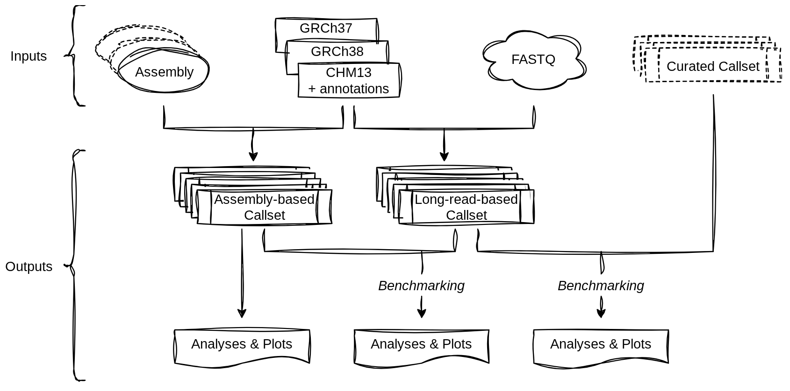

# SVBench-FW

Modular and extensible framework to evaluate SV callers (from long reads) against SV truthsets created from diploid genomes. The goal of this repository is to simplify SV calling performance evaluation while enabling a fair and standardised evaluation.

This framework is provided as a Snakemake pipeline. Additional python scripts can be used to summarize and plot the results (please refer to [analyses](analyses/README.md)).

### Prerequisites and usage
The prerequisites to run `svbench-fw` are:
* conda/mamba
* snakemake



``` sh
mamba create -c bioconda -c conda-forge -n svbench snakemake-minimal seaborn
conda activate svbench
# edit config/config.yml
snakemake -c 16 --use-conda --configfile config/config.yaml -p [-n]

WD=$(grep "wd:" ./config/config.yaml | cut -f2 -d" ")
ls $WD/*.csv
```
#### Use case
`svbench-fw` can be used for:
* compare assembly-based SV callers
* evaluate long-read-based SV callers against assembly-based callsets
* evaluate long-read-based SV callers against curated callsets (e.g., GIAB v5.0q)
* analyze the results, as described and presented in the manuscript

The framework can be easily extended with new callers by adding new rules to the Snakemake workflow and including it in the `config.yaml` file.

#### Supported tools
All these tools are automatically installed by Snakemake (via conda or by pulling from corresponding github repository).

Read alignment:
* minimap2 (v2.30)

Small variants caller:
* deepvariant (v1.9.0)

Small variants phasing:
* whatshap (v2.8)

SV calling from long reads:
* SVDSS (v1.0.5)
* sniffles (v2.7.2)
* cuteSV (v2.1.3)
* debreak (v1.3)
* SVision-pro (v2.5)
* Severus (v1.4.0)
* sawfish (v2.2.1)

SV calling from diploid assemblies:
* dipcall (v0.3)
* svim-asm (v1.0.3)
* hapdiff (commit e0abbb9)

Benchmarkers:
* truvari (v5.4.0)

### Example
To test `svbench-fw`, we provide example data (zenodo) and the following instructions:
```
git clone https://github.com/ldenti/svbench-fw.git
cd svbench-fw

# mamba create -c bioconda -c conda-forge -n svbench snakemake-minimal
conda activate svbench

mkdir svbench-example
cd svbench-example
wget https://zenodo.org/records/17608271/files/svbench-fw.exampledata.tar.gz
tar xvfz svbench-fw.exampledata.tar.gz
bash write_config.sh > config.yml
cd ..
snakemake -c 4 --use-conda --configfile ./svbench-example/config.yml -p [-n]
ls ./svbench-example/SMK_OUT/*.csv
```

*Note 1:* this should take ~half an hour (using 4 threads)

*Note 2:* recall of all tools will be low since reads cover a small region of the chromosome whereas truthsets and contigs cover the entire chromosome.

### Experiments
Information on the data used in our experiments can be found [here](data/README.md). Please, edit the `config/config.yaml accordingly and then run the Snakemake pipeline (two times, one per individual, i.e., HG002 and NA12878). Finally, to replicate the results/plots presented in the manuscript, follow the [instructions](analyses/README.md) in the `analyses` folder.
